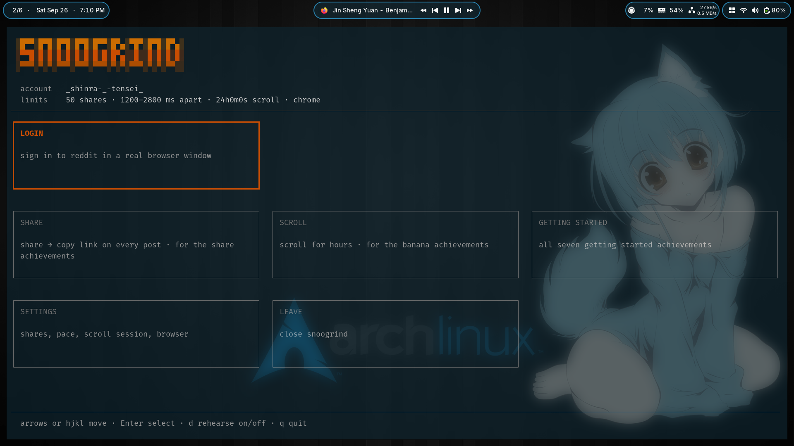

# snoogrind

Grind Reddit achievements from one terminal UI. Drives a real browser through
Playwright and uses the session you are already logged into. No API token.

<p align="center"></p>

- **share** · share → copy link on every post in your feed
- **scroll** · scrolls for hours and nothing else, for the banana badges
- **getting started** · the seven newcomer badges in one pass

## Install

```bash
git clone https://github.com/codeyevsky/snoogrind.git
cd snoogrind && go build -o bin/snoogrind .
install -Dm755 bin/snoogrind ~/.local/bin/snoogrind
```

Go 1.25+. State lives in `~/.local/share/snoogrind/`.

## Use

```bash
snoogrind
```

Pick **login** first, sign in by hand in the window that opens, then pick a
grinder. Arrows or `hjkl` move, Enter selects, `q` quits. Inside a run, `p`
pauses and `s` stops.

`d` toggles **rehearsal mode**: every screen finds the controls it would press
and reports them without pressing anything. Reddit moves its markup around, so
check with this before turning something loose on your account.

## Notes

- **Headless does not work.** Reddit blocks it. Windowed by default.
- **A fresh profile gets a "prove your humanity" wall.** snoogrind waits 90
  seconds and it usually clears itself. Otherwise solve it once by hand, the
  profile is persistent.
- **Sharing has no daily cap**, so `shares per run = 1000` takes that whole
  ladder in one sitting. Already shared posts are skipped on later runs.
- **The banana count is an estimate.** Reddit never published how long its
  banana is; snoogrind guesses 18 cm (`banana_cm` in `config.json`) and keeps
  its own tally. It cannot read Reddit's counter.
- **Reddit words the newcomer badges as "via the Reddit app"** and snoogrind
  drives the web, so those seven may not all register. A profile banner and
  description only get set from text and an image you supply; verification
  needs a code, so that one stays yours.
- **If the markup changes**, runs start reporting `[?]`. Fix `findShareJS` and
  `findCopyJS` in `internal/engine/feed.go`.

Every screen has a subcommand behind it for scripts and ssh: `snoogrind share`,
`scroll`, `badges`, `login`. `snoogrind --help` lists the flags.

Same family as [`liout`](https://github.com/codeyevsky/liout) and
[`githubFlex`](https://github.com/codeyevsky/ghFlex).

MIT.
